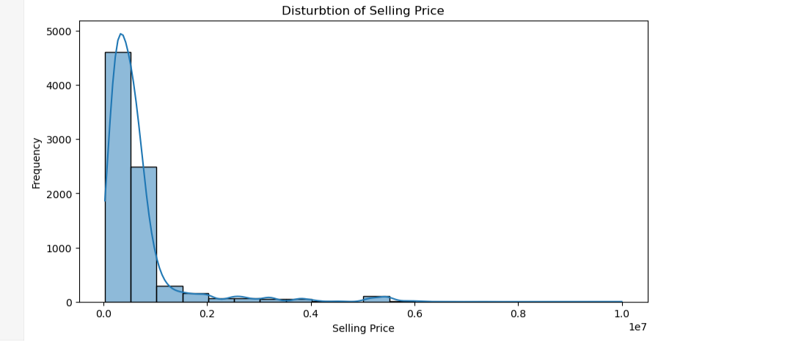

# 🚗 Car Price Analysis using Python

## 📌 Objective
The goal of this project is to analyze car data and identify key factors affecting the selling price.

## 📊 Sample Visualization

---

## 🛠️ Tools & Technologies
- Python
- Pandas
- NumPy
- Matplotlib
- Seaborn

---

## 🔄 Steps Performed
- Data Cleaning (removed units like kmpl, CC, bhp)
- Feature Engineering (created car age feature)
- Encoding categorical variables
- Exploratory Data Analysis (EDA)

---

## 📊 Key Insights
- Newer cars have higher selling prices
- Cars with lower kilometers driven have better resale value
- Selling price decreases as car age increases
- Most cars fall within the lower to mid price range

---

## 📁 Files in Repository
- `Car Price Analysis using Python.ipynb`
- `Car_details.csv`

---

## 👤 Author
Nikhil Desai
